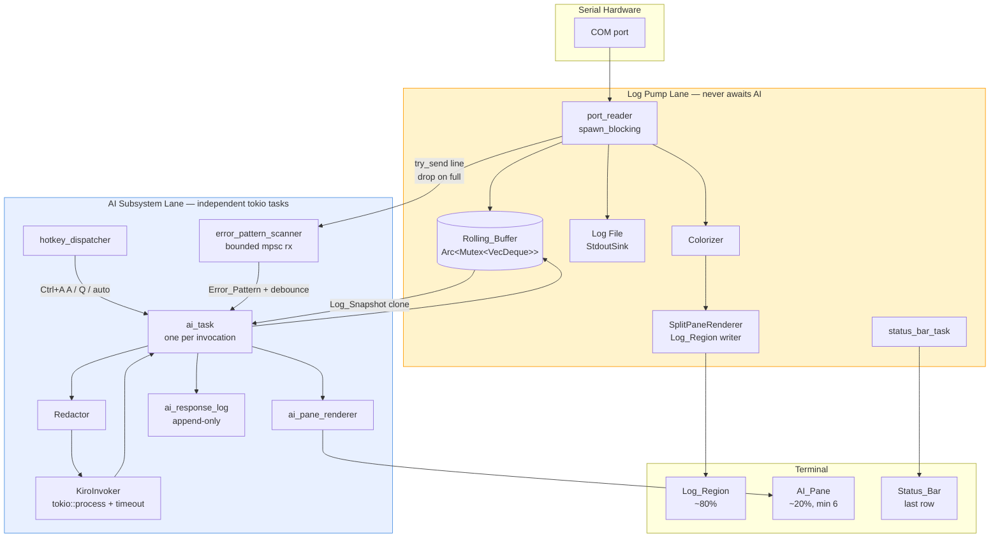

# Design Document — Kiro CLI Log Analysis

## Overview

This feature extends the existing `madputty` serial terminal with an AI analysis lane powered by Amazon's `kiro-cli`. The design is explicitly **additive**: every new module, task, and channel lives alongside the current serial byte pump rather than rewriting it. When AI is disabled (no `kiro-cli` on PATH, `--no-ai`, or undersized terminal) `madputty` is bit-for-bit identical to the pre-feature build.

Two independent lanes share the terminal and share exactly one piece of state, the `Rolling_Buffer`:

- **Log pump lane** — the existing `port_reader` → `Colorizer` → stdout chain, with one new fan-out: a `try_send` into a bounded channel feeding the AI subsystem, and an append into the `Rolling_Buffer` (Requirements 16.1–16.7, 17.1–17.5).
- **AI subsystem lane** — a set of tokio tasks that own `kiro-cli` invocation, the `AI_Pane` render state, auto-watch pattern matching, per-session response persistence, and the Ctrl+A A/Q/L hotkey handling. This lane never holds a lock or channel that the log pump awaits (Requirements 16.1, 16.2, 16.7).

The existing `ExitStateMachine` is extended from a two-byte Ctrl+A Ctrl+X recognizer to a prefix-dispatch state machine that recognizes Ctrl+A followed by `A`, `Q`, `L`, `X` (Requirements 3.6, 4.7, 9.5, 15.2). The existing `Colorizer` is **not** modified; instead we intercept the `port_reader`'s stdout write and route it through a new `SplitPaneRenderer` that knows about the `Log_Region` bounds, so colored bytes still come out of the same colorizer but land inside a scroll region instead of consuming the whole terminal.

One new runtime dependency — `regex = "1"` — is added to `Cargo.toml` solely for the redactor's pattern set (Requirements 6.1–6.10, 18.1–18.2).

## Architecture

### Component diagram — two lanes running independently

**Key property of the diagram:** there is exactly one arrow from the log lane into the AI lane (`PR --> SCAN`), and it is a `try_send` on a bounded `mpsc::channel(32)`. When full, the line is dropped from the AI path and continues to flow through `SPR` and `LF` unaffected (Requirement 16.4). There is zero backpressure from AI to log.
