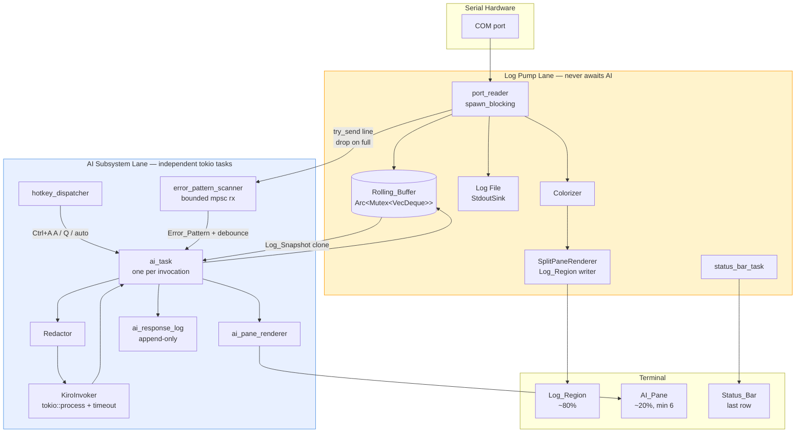
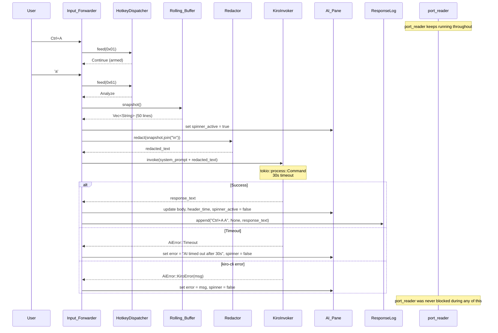
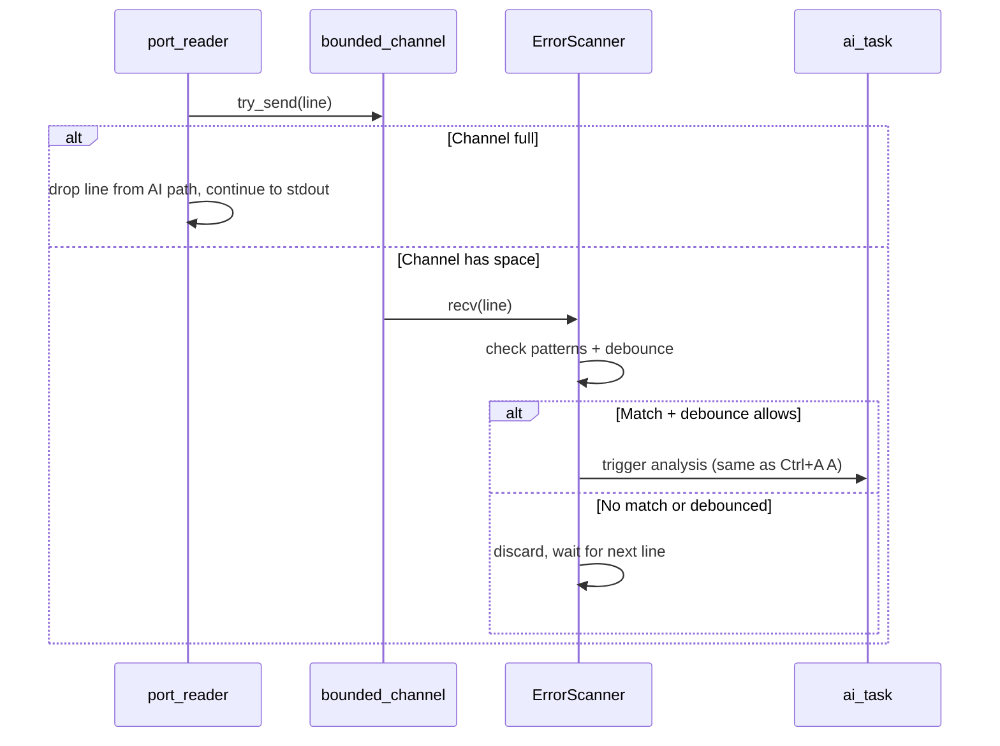

# Design Document — Kiro CLI Log Analysis

## Overview

This feature extends the existing `madputty` serial terminal with an AI analysis lane powered by Amazon's `kiro-cli`. The design is explicitly **additive**: every new module, task, and channel lives alongside the current serial byte pump rather than rewriting it. When AI is disabled (no `kiro-cli` on PATH, `--no-ai`, or undersized terminal) `madputty` is bit-for-bit identical to the pre-feature build.

Two independent lanes share the terminal and share exactly one piece of state, the `Rolling_Buffer`:

- **Log pump lane** — the existing `port_reader` → `Colorizer` → stdout chain, with one new fan-out: a `try_send` into a bounded channel feeding the AI subsystem, and an append into the `Rolling_Buffer` (Requirements 16.1–16.7, 17.1–17.5).
- **AI subsystem lane** — a set of tokio tasks that own `kiro-cli` invocation, the `AI_Pane` render state, auto-watch pattern matching, per-session response persistence, and the Ctrl+A A/Q/L hotkey handling. This lane never holds a lock or channel that the log pump awaits (Requirements 16.1, 16.2, 16.7).

The existing `ExitStateMachine` is extended from a two-byte Ctrl+A Ctrl+X recognizer to a prefix-dispatch state machine that recognizes Ctrl+A followed by `A`, `Q`, `L`, `X` (Requirements 3.6, 4.7, 9.5, 15.2). The existing `Colorizer` is **not** modified; instead we intercept the `port_reader`'s stdout write and route it through a new `SplitPaneRenderer` that knows about the `Log_Region` bounds, so colored bytes still come out of the same colorizer but land inside a scroll region instead of consuming the whole terminal.

One new runtime dependency — `regex = "1"` — is added to `Cargo.toml` solely for the redactor's pattern set (Requirements 6.1–6.10, 18.1–18.2).

## Architecture

### Component diagram — two lanes running independently



**Key property of the diagram:** there is exactly one arrow from the log lane into the AI lane (`PR --> SCAN`), and it is a `try_send` on a bounded `mpsc::channel(32)`. When full, the line is dropped from the AI path and continues to flow through `SPR` and `LF` unaffected (Requirement 16.4). There is zero backpressure from AI to log.

### Design decisions and rationale

| Decision | Rationale |
|----------|-----------|
| `try_send` + drop-on-full for log→AI channel | Guarantees log pump never blocks. AI is best-effort. |
| `Arc<Mutex<VecDeque<String>>>` for Rolling_Buffer | Mutex held only for push (O(1)) and snapshot (clone the VecDeque). Lock contention is negligible at 921600 baud (~100 lines/sec). |
| Extend `ExitStateMachine` to prefix-dispatch | Reuses existing Ctrl+A detection. Adding A/Q/L/X dispatch is a small enum change, not a rewrite. |
| `SplitPaneRenderer` wraps stdout, not Colorizer | Colorizer stays untouched. Renderer sets ANSI scroll region so log bytes land in the top N rows. AI pane writes below the scroll region. |
| `tokio::process::Command` for kiro-cli | Async child process with built-in `timeout()`. No need for a custom process manager. |
| One AI_Task at a time (latest wins) | If user presses Ctrl+A A while a previous analysis is running, the old task is cancelled and a new one starts. Prevents stale responses. |
| Regex-based redaction with compiled patterns | Patterns compiled once at startup. Applied per-snapshot. Idempotent by construction (replacements don't match the patterns). |
| Session-scoped AI response log (Markdown) | Append-only file per session. Markdown for readability. Timestamp headers for grep. |

## Module layout

```
src/
  main.rs              # MODIFIED: add mod ai, mod ui; dispatch kiro-login/kiro-status
  cli.rs               # MODIFIED: add --ai-watch, --ai-timeout-seconds, --no-redact,
                        #   --no-ai flags; add KiroLogin/KiroStatus subcommands
  session.rs           # MODIFIED: integrate SplitPaneRenderer, spawn AI subsystem tasks,
                        #   wire hotkey dispatch, manage Rolling_Buffer
  errors.rs            # MODIFIED: add AiError variant (non-fatal, logged not exited)
  io/
    keymap.rs          # MODIFIED: extend ExitStateMachine to HotkeyDispatcher
    colorizer.rs       # UNCHANGED
    stdout_sink.rs     # UNCHANGED (log file fan-out only; stdout goes through renderer)
    mod.rs             # UNCHANGED
  serial_config.rs     # UNCHANGED
  list.rs              # UNCHANGED
  theme.rs             # MODIFIED: add AI pane styles (header, spinner, error, separator)
  ai/                  # NEW directory
    mod.rs             # AI subsystem orchestrator: detect kiro-cli, spawn tasks, manage state
    redactor.rs        # Redaction engine: compile patterns, apply to snapshots
    kiro_invoker.rs    # Shell out to kiro-cli chat, enforce timeout, parse response
    rolling_buffer.rs  # Arc<Mutex<VecDeque<String>>> with push + snapshot
    error_scanner.rs   # Bounded channel consumer, regex pattern match, debounce timer
    response_log.rs    # Append AI responses to ~/.madputty/ai-responses/<session_id>.md
    pane.rs            # AI pane state: header, body, spinner, truncation, modal overlay
  ui/                  # NEW directory
    mod.rs             # Re-exports
    split_pane.rs      # SplitPaneRenderer: ANSI scroll region management, resize handler
```

### Files touched vs new

| Category | Files |
|----------|-------|
| New modules | `src/ai/mod.rs`, `redactor.rs`, `kiro_invoker.rs`, `rolling_buffer.rs`, `error_scanner.rs`, `response_log.rs`, `pane.rs` |
| New modules | `src/ui/mod.rs`, `split_pane.rs` |
| Modified | `src/main.rs`, `src/cli.rs`, `src/session.rs`, `src/io/keymap.rs`, `src/theme.rs`, `src/errors.rs`, `Cargo.toml` |
| Unchanged | `src/io/colorizer.rs`, `src/io/stdout_sink.rs`, `src/io/mod.rs`, `src/serial_config.rs`, `src/list.rs` |

## Key interfaces

### HotkeyDispatcher (extends ExitStateMachine)

```rust
// src/io/keymap.rs — replaces ExitStateMachine

pub enum HotkeyAction {
    Forward(Vec<u8>),    // Normal bytes → serial port
    Exit,                // Ctrl+A X → terminate session
    Analyze,             // Ctrl+A A → trigger AI analysis
    AskQuestion,         // Ctrl+A Q → open question prompt
    ShowLastResponse,    // Ctrl+A L → show full last response
    Continue,            // Non-key event, ignore
}

pub struct HotkeyDispatcher {
    armed: bool,         // true after Ctrl+A received
    ai_enabled: bool,    // false when AI_Features_Disabled
}

impl HotkeyDispatcher {
    pub fn feed(&mut self, bytes: &[u8]) -> HotkeyAction;
}
```

State machine:
- Idle + `0x01` (Ctrl+A) → Armed
- Armed + `0x18` (Ctrl+X) → `Exit`
- Armed + `0x01` (A) → `Analyze` (if ai_enabled, else `Forward([0x01, 0x01])`)
- Armed + `0x11` (Q) → `AskQuestion` (if ai_enabled)
- Armed + `0x0C` (L) → `ShowLastResponse` (if ai_enabled)
- Armed + other → `Forward([0x01, other])`

Wait — Ctrl+A A means the user presses Ctrl+A then the letter 'a' (lowercase 0x61 or uppercase 0x41). Not Ctrl+A Ctrl+A. Let me correct:

- Armed + `b'a'` or `b'A'` (0x61/0x41) → `Analyze`
- Armed + `b'q'` or `b'Q'` (0x71/0x51) → `AskQuestion`
- Armed + `b'l'` or `b'L'` (0x6C/0x4C) → `ShowLastResponse`
- Armed + `0x18` (Ctrl+X) → `Exit`
- Armed + anything else → `Forward([0x01, byte])`

### Redactor

```rust
// src/ai/redactor.rs

pub struct Redactor {
    patterns: Vec<(Regex, &'static str)>,  // (pattern, replacement)
}

impl Redactor {
    /// Build with default patterns. Called once at startup.
    pub fn new() -> Self;

    /// Apply all patterns. Idempotent: redact(redact(x)) == redact(x).
    pub fn redact(&self, input: &str) -> String;
}
```

Default patterns (from Requirement 6):
1. `password=\S+` → `password=[REDACTED]`
2. `token=\S+` → `token=[REDACTED]`
3. `\d{1,3}\.\d{1,3}\.\d{1,3}\.\d{1,3}` → `[IP]`
4. `([0-9A-Fa-f]{2}:){5}[0-9A-Fa-f]{2}` → `[MAC]`
5. `SSID=\S+` → `SSID=[SSID]`
6. `(?i)(api[_-]?key|secret[_-]?key|access[_-]?key)\s*[=:]\s*\S+` → matched key name + `=[REDACTED]`

### KiroInvoker

```rust
// src/ai/kiro_invoker.rs

pub struct KiroInvoker {
    kiro_path: PathBuf,       // Resolved absolute path to kiro-cli
    timeout: Duration,        // Default 30s, overridden by --ai-timeout-seconds
}

impl KiroInvoker {
    /// Spawn kiro-cli chat --no-interactive "<prompt>", enforce timeout.
    /// Returns the AI response text or an error.
    pub async fn invoke(&self, prompt: &str) -> Result<String, AiError>;
}
```

Implementation:
1. `tokio::process::Command::new(&self.kiro_path).args(["chat", "--no-interactive", prompt]).stdout(Stdio::piped()).stderr(Stdio::piped()).spawn()`
2. `tokio::time::timeout(self.timeout, child.wait_with_output())`
3. On timeout: `child.kill()`, return `AiError::Timeout`
4. On non-zero exit: return `AiError::KiroError(stderr_first_line)`
5. On success: return `String::from_utf8_lossy(stdout)`

### RollingBuffer

```rust
// src/ai/rolling_buffer.rs

pub struct RollingBuffer {
    inner: Arc<Mutex<VecDeque<String>>>,
    capacity: usize,  // 50
}

impl RollingBuffer {
    pub fn push(&self, line: String);           // Lock, push_back, pop_front if over capacity
    pub fn snapshot(&self) -> Vec<String>;      // Lock, clone into Vec
}
```

The `push` lock is held for microseconds (one push + optional pop). The `snapshot` lock is held for the duration of a `VecDeque::iter().cloned().collect()` — at 50 lines this is sub-microsecond. No contention risk at 921600 baud.

### SplitPaneRenderer

```rust
// src/ui/split_pane.rs

pub struct SplitPaneRenderer {
    term_width: u16,
    term_height: u16,
    log_region_height: u16,    // term_height - ai_pane_height - 1 (status bar)
    ai_pane_height: u16,       // max(6, term_height * 20 / 100)
    ai_pane_top_row: u16,      // log_region_height + 1
    status_bar_row: u16,       // term_height
}

impl SplitPaneRenderer {
    /// Set up ANSI scroll region for the log area (rows 1..log_region_height).
    /// This confines all scrolling output to the top region.
    pub fn setup(&self) -> io::Result<()>;

    /// Write bytes to the log region (within the scroll region).
    pub fn write_log(&self, bytes: &[u8]) -> io::Result<()>;

    /// Redraw the AI pane content at ai_pane_top_row.
    pub fn draw_ai_pane(&self, state: &AiPaneState) -> io::Result<()>;

    /// Redraw the status bar at the last row.
    pub fn draw_status_bar(&self, status: &str) -> io::Result<()>;

    /// Handle terminal resize: recompute dimensions, reset scroll region.
    pub fn on_resize(&mut self, new_width: u16, new_height: u16) -> io::Result<()>;

    /// Tear down: reset scroll region to full terminal on exit.
    pub fn teardown(&self) -> io::Result<()>;
}
```

ANSI scroll region approach:
- `\x1b[1;{log_region_height}r` — sets the scroll region to rows 1 through log_region_height
- All subsequent `\n` in the log region scrolls only within that region
- AI pane and status bar are drawn by moving the cursor below the scroll region with `\x1b[{row};1H`
- On resize: `crossterm::terminal::size()` → recompute → `\x1b[1;{new_height}r` → redraw

### AiPaneState

```rust
// src/ai/pane.rs

pub struct AiPaneState {
    pub header_time: Option<String>,     // "HH:MM:SS" of last successful response
    pub body: String,                     // Full response text
    pub body_truncated: bool,             // True if body exceeds pane height
    pub spinner_active: bool,             // True while AI_Task is running
    pub error: Option<String>,            // Last error message (red)
    pub modal_open: bool,                 // True when Ctrl+A L overlay is showing
    pub modal_scroll_offset: usize,       // Scroll position in modal
}
```

### ErrorScanner

```rust
// src/ai/error_scanner.rs

pub struct ErrorScanner {
    patterns: Vec<Regex>,                 // Compiled from Error_Pattern list
    last_trigger: Option<Instant>,        // For 30s debounce
    debounce: Duration,                   // 30 seconds
}

impl ErrorScanner {
    /// Check a line. Returns true if an error pattern matched AND debounce allows.
    pub fn check(&mut self, line: &str) -> bool;
}
```

Default patterns (case-sensitive substrings compiled as regex):
- `" E "` (log level marker with spaces)
- `"ERROR"`, `"FAIL"`, `"FAILED"`, `"PANIC"`, `"EXCEPTION"`, `"TIMEOUT"`

### ResponseLog

```rust
// src/ai/response_log.rs

pub struct ResponseLog {
    path: PathBuf,           // ~/.madputty/ai-responses/<session_id>.md
    has_entries: bool,        // Track whether we wrote anything (for exit message)
}

impl ResponseLog {
    /// Append a timestamped entry. Creates file + directory on first write.
    pub fn append(&mut self, trigger: &str, question: Option<&str>, response: &str) -> io::Result<()>;

    /// Returns true if at least one entry was written.
    pub fn has_entries(&self) -> bool;

    /// Returns the absolute path for the exit message.
    pub fn path(&self) -> &Path;
}
```

Markdown format per entry:
```markdown
## 2026-04-21 12:34:56 — Manual analysis
Trigger: Ctrl+A A

<response text>

---
```

For custom questions:
```markdown
## 2026-04-21 12:35:10 — Custom question
Trigger: Ctrl+A Q
Question: why is WiFi failing?

<response text>

---
```

## Data flow — manual analysis (Ctrl+A A)



## Data flow — auto-watch mode



## Split-pane terminal rendering

### Setup sequence

1. Query terminal size: `crossterm::terminal::size()` → `(width, height)`
2. If `height < 12`: enter Fallback_Mode (no split, log-only)
3. Compute: `ai_pane_height = max(6, height * 20 / 100)`, `log_region_height = height - ai_pane_height - 1`
4. Set ANSI scroll region: `\x1b[1;{log_region_height}r`
5. Move cursor to row 1, column 1
6. Draw AI pane separator at `ai_pane_top_row` (yellow box-drawing line)
7. Draw empty AI pane body
8. Draw status bar at last row

### During session

- **Log bytes**: written to stdout while cursor is in the scroll region. The terminal auto-scrolls within the region. No cursor positioning needed for log output.
- **AI pane updates**: save cursor position → move to `ai_pane_top_row` → clear pane rows → draw header + body → restore cursor position. This is a brief operation (~1ms) and happens only when AI responds (not per-byte).
- **Status bar**: same as current — write to last row via `\r\x1b[2K` on stderr. Moves to the absolute last row.
- **Resize**: `crossterm::event::Event::Resize(w, h)` → recompute → reset scroll region → redraw AI pane + status bar.

### Teardown

1. Reset scroll region: `\x1b[r` (full terminal)
2. Move cursor below last content
3. Print session summary (existing behavior)

## CLI changes

### New flags on Connect command

```rust
// Added to the Connect variant in cli.rs

/// Enable automatic AI analysis on error detection
#[arg(long)]
pub ai_watch: bool,

/// AI call timeout in seconds (default 30)
#[arg(long, default_value_t = 30)]
pub ai_timeout_seconds: u32,

/// Disable credential redaction before AI calls (with warning)
#[arg(long)]
pub no_redact: bool,

/// Force AI features off even if kiro-cli is installed
#[arg(long)]
pub no_ai: bool,
```

### New subcommands

```rust
#[derive(Subcommand)]
pub enum Subcmd {
    List,
    KiroLogin,
    KiroStatus,
}
```

`KiroLogin` → `std::process::Command::new("kiro-cli").arg("login").status()`
`KiroStatus` → `std::process::Command::new("kiro-cli").args(["whoami", "--no-interactive"]).status()`

## Error handling

New variant in `MadPuttyError`:

```rust
#[error("AI error: {0}")]
AiError(String),
```

This variant maps to exit code 1 but is **never used to exit the process during a session**. AI errors are caught by the AI task and rendered in the AI pane. The session continues. Only `kiro-login` and `kiro-status` subcommands propagate AI errors to the exit code.

## Kiro CLI detection flow

```rust
// src/ai/mod.rs

pub struct AiSubsystem {
    kiro_path: Option<PathBuf>,
    logged_in: bool,
    enabled: bool,
}

impl AiSubsystem {
    pub async fn detect(no_ai: bool) -> Self {
        if no_ai { return Self { kiro_path: None, logged_in: false, enabled: false }; }

        let kiro_path = which_kiro_cli();  // PATH lookup
        if kiro_path.is_none() {
            eprintln!("⚠ kiro-cli not found — AI analysis disabled. Install kiro-cli for AI features.");
            return Self { kiro_path: None, logged_in: false, enabled: false };
        }

        let logged_in = check_login(&kiro_path.unwrap()).await;  // 5s timeout
        if !logged_in {
            eprintln!("⚠ kiro-cli found but not logged in. Run `madputty kiro-login` to enable AI.");
        }

        Self { kiro_path, logged_in, enabled: true }
    }
}
```

## System prompt

Exact text (Requirement 7.2):

```
You are a serial log analyst helping a firmware engineer. Analyze these live serial logs and explain what is happening in plain English. Call out errors, state transitions, and likely root causes. Be concise — 3 to 5 sentences. If you see WiFi connection attempts, identify the security mode, SSID if present, and whether the attempt succeeded or failed.
```

For custom questions (Ctrl+A Q), the user's question replaces the system prompt but the log context is still appended.

## Dependency changes

```toml
# Cargo.toml additions
regex = "1"

# No other new dependencies. tokio process + time features already available.
# crossterm already provides terminal size + cursor positioning.
```

## Testing strategy

| Test | Owner | Approach |
|------|-------|----------|
| Redactor idempotence | CLI | proptest: `redact(redact(x)) == redact(x)` for arbitrary strings |
| Redactor leak prevention | CLI | proptest: output never contains original password/token/IP values |
| HotkeyDispatcher state machine | IDE | unit tests: all Ctrl+A + letter combinations |
| Non-blocking log pump | CLI | integration test: spawn madputty --plain, inject slow mock kiro-cli, assert bytes keep flowing |
| Split-pane redraw perf | CLI | criterion benchmark at 921600 baud equivalent throughput |
| KiroInvoker timeout | IDE | unit test with a sleep-based mock process |
| ErrorScanner debounce | IDE | unit test: rapid-fire error lines, assert only one trigger per 30s window |
