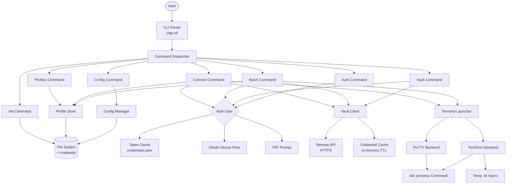
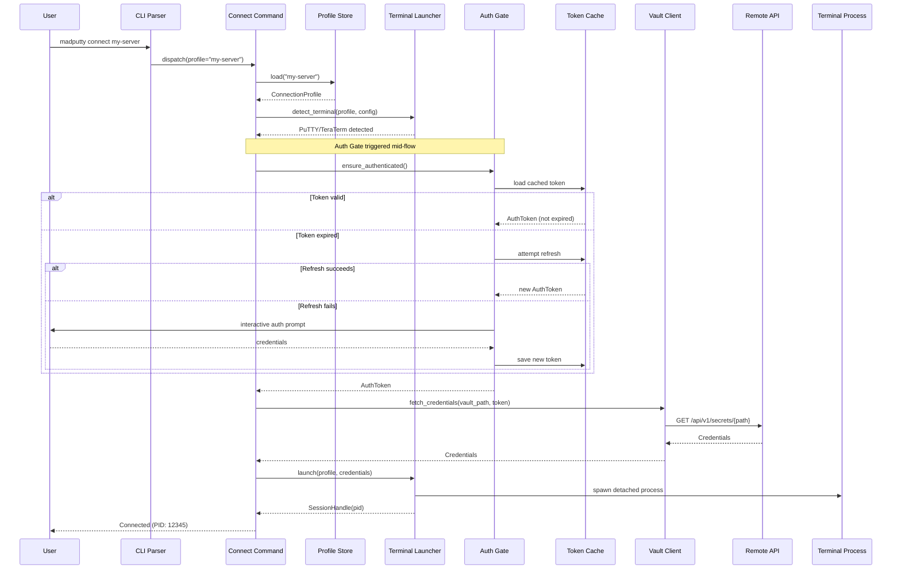

# Design Document: MadPutty CLI

## Overview

MadPutty is a Rust CLI tool for Windows that orchestrates SSH and serial terminal sessions through a mid-flow authentication pattern. The tool manages connection profiles locally as TOML files, authenticates against a remote API only when remote resources are needed, fetches credentials from a vault, and launches PuTTY or TeraTerm terminal sessions with those credentials.

The defining architectural principle is lazy authentication: local operations (profile CRUD, init, config) execute without any network calls, while remote operations (connect, vault fetch, batch) trigger the Auth_Gate only at the point where credentials are required. This keeps the CLI fast and offline-capable for local work.

### Key Design Decisions

1. **Mid-flow auth via `ensure_authenticated()`** — called lazily, not at startup. Commands progress through local steps before hitting the auth gate.
2. **Trait-based terminal backends** — `TerminalLauncher` trait abstracts over PuTTY and TeraTerm, enabling future backends without restructuring.
3. **Individual TOML profile files** — each profile is a standalone file in `~/.madputty/profiles/`, enabling simple CRUD and git-friendly diffing.
4. **JSON token cache** — `~/.madputty/credentials.json` stores auth tokens with expiry for fast cache checks.
5. **Credential caching with TTL** — in-memory cache avoids redundant vault API calls during batch operations.
6. **clap v4 derive macros** — type-safe CLI parsing with subcommand enums.
7. **tokio async runtime** — for HTTP operations (OAuth polling, vault fetches).
8. **thiserror for typed errors** — each error variant maps to a specific exit code.

## Architecture

### High-Level Component Diagram



### Mid-Flow Authentication Sequence

The `connect` command demonstrates the core mid-flow auth pattern:



## Components and Interfaces

### Module Structure

```
madputty/
├── Cargo.toml
├── src/
│   ├── main.rs                  # tokio::main, clap parse, command dispatch
│   ├── cli.rs                   # clap derive structs and enums
│   ├── errors.rs                # MadPuttyError enum with thiserror
│   ├── auth/
│   │   ├── mod.rs               # ensure_authenticated() orchestration
│   │   ├── token.rs             # AuthToken: load/save/refresh/validate
│   │   ├── oauth.rs             # OAuth device code flow
│   │   └── prompt.rs            # Interactive PAT prompt
│   ├── api/
│   │   ├── mod.rs               # ApiClient with shared reqwest::Client
│   │   ├── secrets.rs           # Vault credential fetching + cache
│   │   └── sessions.rs          # Session audit logging
│   ├── terminal/
│   │   ├── mod.rs               # TerminalLauncher trait + detect_terminal()
│   │   ├── putty.rs             # PuTTY/plink implementation
│   │   └── teraterm.rs          # TeraTerm + .ttl macro generation
│   ├── profiles/
│   │   ├── mod.rs               # Profile CRUD operations
│   │   └── models.rs            # ConnectionProfile, SerialConfig, enums
│   ├── commands/
│   │   ├── mod.rs               # Command dispatch
│   │   ├── init.rs              # madputty init
│   │   ├── connect.rs           # madputty connect (mid-flow auth)
│   │   ├── batch.rs             # madputty batch
│   │   ├── profiles.rs          # madputty profiles {list|add|remove}
│   │   ├── vault.rs             # madputty vault fetch
│   │   ├── auth_cmd.rs          # madputty auth {login|logout|status}
│   │   └── config_cmd.rs        # madputty config {set|show}
│   └── config/
│       └── mod.rs               # AppConfig: TOML + env overrides
```


### Key Interfaces

#### CLI Parser (`cli.rs`)

```rust
use clap::{Parser, Subcommand};
use std::path::PathBuf;

#[derive(Parser)]
#[command(name = "madputty", version, about = "SSH/Serial connection manager with mid-flow auth")]
pub struct Cli {
    #[command(subcommand)]
    pub command: Command,

    /// Enable verbose debug output
    #[arg(long, global = true)]
    pub verbose: bool,

    /// Show command without executing
    #[arg(long, global = true)]
    pub dry_run: bool,

    /// Disable interactive prompts
    #[arg(long, global = true)]
    pub no_interactive: bool,
}

#[derive(Subcommand)]
pub enum Command {
    /// Initialize ~/.madputty directory structure
    Init,
    /// Manage connection profiles
    Profiles {
        #[command(subcommand)]
        action: ProfileAction,
    },
    /// Connect to a profile
    Connect {
        /// Profile name
        profile: String,
        /// Override terminal type
        #[arg(long)]
        terminal: Option<TerminalType>,
    },
    /// Batch connect to a group
    Batch {
        /// Group name
        group: String,
    },
    /// Vault operations
    Vault {
        #[command(subcommand)]
        action: VaultAction,
    },
    /// Authentication management
    Auth {
        #[command(subcommand)]
        action: AuthAction,
    },
    /// Configuration management
    Config {
        #[command(subcommand)]
        action: ConfigAction,
    },
}

#[derive(Subcommand)]
pub enum ProfileAction {
    List,
    Add,
    Remove { name: String },
}

#[derive(Subcommand)]
pub enum VaultAction {
    Fetch { path: String },
}

#[derive(Subcommand)]
pub enum AuthAction {
    Login,
    Logout,
    Status,
}

#[derive(Subcommand)]
pub enum ConfigAction {
    Set { key: String, value: String },
    Show,
}
```

#### Auth Gate (`auth/mod.rs`)

```rust
/// The core mid-flow authentication function.
/// Called lazily by commands that need remote resources.
/// Returns a valid token or exits with code 2.
pub async fn ensure_authenticated(
    config: &AppConfig,
    no_interactive: bool,
) -> Result<AuthToken, MadPuttyError>;
```

Decision flow:
1. Check `MADPUTTY_AUTH_TOKEN` env var → use directly if set
2. Load `~/.madputty/credentials.json` → return if token not expired
3. Attempt token refresh using stored refresh token
4. If interactive allowed → prompt via configured method (PAT or OAuth device flow)
5. If `--no-interactive` → return `MadPuttyError::AuthRequired` (exit code 2)

#### Terminal Launcher Trait (`terminal/mod.rs`)

```rust
use std::path::PathBuf;

/// Trait abstracting terminal emulator backends.
/// Each implementation handles detection, argument building, and process spawning.
pub trait TerminalLauncher {
    /// Detect the terminal executable at configured path or via PATH lookup.
    fn detect(&self, config: &AppConfig) -> Result<PathBuf, MadPuttyError>;

    /// Build command-line arguments for the terminal.
    fn build_args(
        &self,
        profile: &ConnectionProfile,
        creds: &Credentials,
    ) -> Vec<String>;

    /// Spawn the terminal process in detached mode.
    fn launch(
        &self,
        config: &AppConfig,
        profile: &ConnectionProfile,
        creds: &Credentials,
    ) -> Result<SessionHandle, MadPuttyError>;
}

/// Select the appropriate TerminalLauncher based on config/profile/flag.
pub fn detect_terminal(
    terminal_override: Option<TerminalType>,
    profile: &ConnectionProfile,
    config: &AppConfig,
) -> Result<Box<dyn TerminalLauncher>, MadPuttyError>;
```

#### Vault Client (`api/secrets.rs`)

```rust
/// Fetch credentials from the vault API.
/// Uses in-memory credential cache with TTL to avoid redundant calls.
pub async fn fetch_credentials(
    client: &ApiClient,
    token: &AuthToken,
    secret_path: &str,
) -> Result<Credentials, MadPuttyError>;
```

On HTTP 401: clears cached token, invokes `ensure_authenticated()` once more, retries. Second 401 → exit code 2.

#### Profile Store (`profiles/mod.rs`)

```rust
/// Load a profile by name from ~/.madputty/profiles/{name}.toml
pub fn load_profile(name: &str) -> Result<ConnectionProfile, MadPuttyError>;

/// List all profiles from the profile store directory.
pub fn list_profiles() -> Result<Vec<ConnectionProfile>, MadPuttyError>;

/// Save a profile to ~/.madputty/profiles/{name}.toml
pub fn save_profile(profile: &ConnectionProfile) -> Result<(), MadPuttyError>;

/// Delete a profile TOML file.
pub fn remove_profile(name: &str) -> Result<(), MadPuttyError>;

/// Check if a profile exists.
pub fn profile_exists(name: &str) -> bool;
```

#### Config Manager (`config/mod.rs`)

```rust
/// Load config from ~/.madputty/config.toml with env var overrides.
pub fn load_config() -> Result<AppConfig, MadPuttyError>;

/// Update a single key in the config file.
pub fn set_config_value(key: &str, value: &str) -> Result<(), MadPuttyError>;
```

Environment variable override precedence (highest to lowest):
1. `MADPUTTY_AUTH_TOKEN` — bypasses all auth
2. `MADPUTTY_API_URL` → `api.base_url`
3. `MADPUTTY_TERMINAL` → `general.default_terminal`
4. `MADPUTTY_PUTTY_PATH` → `terminals.putty.path`
5. `MADPUTTY_TERATERM_PATH` → `terminals.teraterm.path`

## Data Models

### ConnectionProfile (`profiles/models.rs`)

```rust
use serde::{Deserialize, Serialize};
use std::path::PathBuf;

#[derive(Debug, Clone, Serialize, Deserialize, PartialEq)]
pub struct ConnectionProfile {
    pub name: String,
    pub host: String,
    pub port: u16,
    pub protocol: Protocol,
    pub username: Option<String>,
    pub auth_type: ProfileAuthType,
    pub vault_secret_path: Option<String>,
    pub ssh_key_path: Option<PathBuf>,
    pub preferred_terminal: Option<TerminalType>,
    pub serial_config: Option<SerialConfig>,
    #[serde(default)]
    pub startup_commands: Vec<String>,
    pub group: Option<String>,
    #[serde(default)]
    pub tags: Vec<String>,
    pub putty_session_name: Option<String>,
}

#[derive(Debug, Clone, Serialize, Deserialize, PartialEq)]
#[serde(rename_all = "lowercase")]
pub enum Protocol {
    Ssh,
    Serial,
    Telnet,
}

#[derive(Debug, Clone, Serialize, Deserialize, PartialEq)]
#[serde(rename_all = "snake_case")]
pub enum ProfileAuthType {
    VaultSecret,
    LocalKey,
    Password,
    Interactive,
}

#[derive(Debug, Clone, Serialize, Deserialize, PartialEq)]
#[serde(rename_all = "lowercase")]
pub enum TerminalType {
    Putty,
    Teraterm,
}

#[derive(Debug, Clone, Serialize, Deserialize, PartialEq)]
pub struct SerialConfig {
    pub com_port: String,
    pub baud_rate: u32,
    pub data_bits: Option<u8>,
    pub stop_bits: Option<u8>,
    pub parity: Option<String>,
}
```

### AuthToken (`auth/token.rs`)

```rust
use chrono::{DateTime, Utc};
use serde::{Deserialize, Serialize};

#[derive(Debug, Clone, Serialize, Deserialize, PartialEq)]
pub struct AuthToken {
    pub access_token: String,
    pub refresh_token: Option<String>,
    pub expires_at: DateTime<Utc>,
    pub auth_method: AuthMethod,
}

#[derive(Debug, Clone, Serialize, Deserialize, PartialEq)]
#[serde(rename_all = "lowercase")]
pub enum AuthMethod {
    Pat,
    Oauth,
}

impl AuthToken {
    pub fn is_expired(&self) -> bool {
        Utc::now() >= self.expires_at
    }
}
```

### Credentials (`api/secrets.rs`)

```rust
use chrono::{DateTime, Utc};
use serde::{Deserialize, Serialize};

#[derive(Debug, Clone, Serialize, Deserialize)]
pub struct Credentials {
    pub username: String,
    pub password: String,
    pub expires_at: Option<DateTime<Utc>>,
}
```

### SessionHandle (`terminal/mod.rs`)

```rust
#[derive(Debug)]
pub struct SessionHandle {
    pub pid: u32,
    pub profile_name: String,
    pub terminal_type: TerminalType,
}
```

### AppConfig (`config/mod.rs`)

```rust
use serde::{Deserialize, Serialize};

#[derive(Debug, Clone, Serialize, Deserialize, PartialEq)]
pub struct AppConfig {
    #[serde(default)]
    pub general: GeneralConfig,
    #[serde(default)]
    pub terminals: TerminalsConfig,
    #[serde(default)]
    pub api: ApiConfig,
    #[serde(default)]
    pub auth: AuthConfig,
}

#[derive(Debug, Clone, Serialize, Deserialize, PartialEq, Default)]
pub struct GeneralConfig {
    pub default_terminal: Option<String>,
    #[serde(default)]
    pub verbose: bool,
}

#[derive(Debug, Clone, Serialize, Deserialize, PartialEq, Default)]
pub struct TerminalsConfig {
    #[serde(default)]
    pub putty: PuttyConfig,
    #[serde(default)]
    pub teraterm: TeratermConfig,
}

#[derive(Debug, Clone, Serialize, Deserialize, PartialEq, Default)]
pub struct PuttyConfig {
    pub path: Option<String>,
    pub plink_path: Option<String>,
}

#[derive(Debug, Clone, Serialize, Deserialize, PartialEq, Default)]
pub struct TeratermConfig {
    pub path: Option<String>,
}

#[derive(Debug, Clone, Serialize, Deserialize, PartialEq, Default)]
pub struct ApiConfig {
    pub base_url: Option<String>,
    #[serde(default = "default_timeout")]
    pub timeout_seconds: u64,
}

fn default_timeout() -> u64 { 30 }

#[derive(Debug, Clone, Serialize, Deserialize, PartialEq, Default)]
pub struct AuthConfig {
    pub method: Option<String>,
    pub oauth_client_id: Option<String>,
    pub oauth_device_url: Option<String>,
    pub oauth_token_url: Option<String>,
}
```

### CredentialCacheEntry (`api/secrets.rs`)

```rust
use std::time::Instant;

pub struct CredentialCacheEntry {
    pub credentials: Credentials,
    pub fetched_at: Instant,
    pub ttl_seconds: u64,
}

impl CredentialCacheEntry {
    pub fn is_expired(&self) -> bool {
        self.fetched_at.elapsed().as_secs() >= self.ttl_seconds
    }
}
```

The in-memory credential cache is a `HashMap<String, CredentialCacheEntry>` keyed by vault secret path, held in the `ApiClient` struct. It is not persisted to disk.
