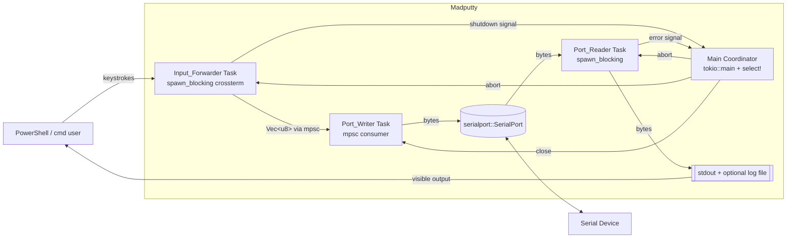
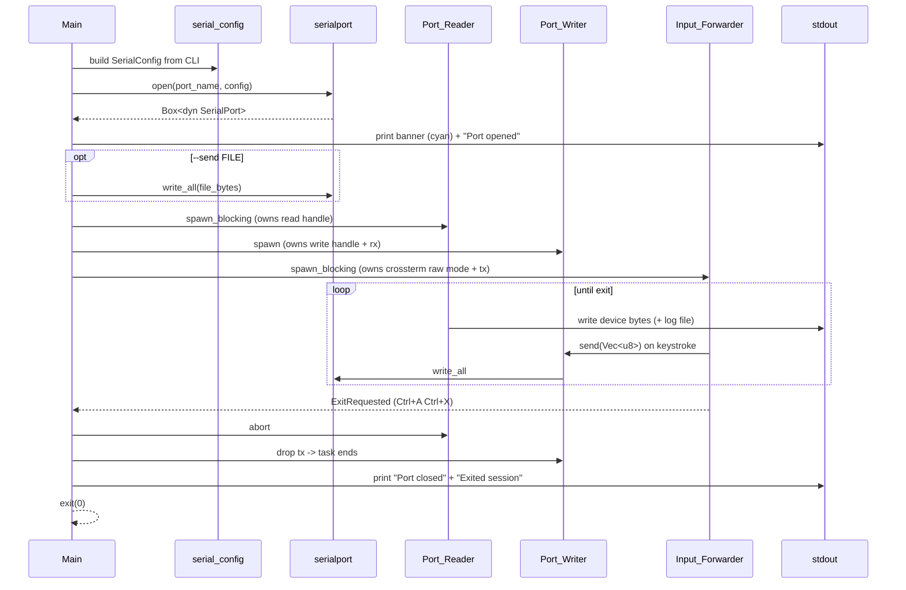

# Design Document

## Overview

This design pivots the `madputty` binary from an SSH/profile launcher into a picocom-style serial terminal that runs inline in a Windows PowerShell or cmd window. The user runs `madputty COM3 --baud 115200`, sees a cyan banner, and then interacts with a bidirectional byte pump: bytes from the COM port stream to stdout, and keystrokes from stdin stream to the COM port. The session terminates on the picocom-compatible Ctrl+A Ctrl+X sequence.

The design keeps the existing crate infrastructure (clap v4, tokio, tracing, thiserror, console) and adds two focused dependencies:

- `serialport` v4 — cross-platform serial port enumeration, open, read, write, close
- `crossterm` v0.27 — raw-mode stdin handling so Ctrl+A / Ctrl+X reach us as bytes instead of being swallowed by the terminal

All legacy modules (SSH, vault, OAuth, profiles, batch, PuTTY/TeraTerm launchers, config loader) are deleted. The final binary contains a small `cli` module, a `session` module that runs the byte pump, a `list` module that enumerates ports, a `serial_config` module that maps CLI args to `serialport` settings, and a trimmed `errors` module with a new `ExitCode` story.

### Design Decisions and Rationale

| Decision | Rationale |
| --- | --- |
| `serialport` crate (blocking API) wrapped in `tokio::task::spawn_blocking` | `serialport` has no native async API. The blocking reads live in a dedicated blocking task with short read timeouts so we can cooperatively shut down. |
| `crossterm` for stdin, not `tokio::io::stdin()` | Windows console stdin in line mode swallows Ctrl+A/Ctrl+X. We need raw mode and `crossterm::event::read` to capture them as key events and translate to bytes. |
| Two-task byte pump + main coordinator | Clean separation: one task reads the port, one task reads the keyboard, the main `select!` coordinates shutdown. Matches the Port_Reader / Input_Forwarder vocabulary from requirements. |
| `tokio::sync::mpsc` channel for port-writes | The Input_Forwarder runs in a synchronous crossterm loop on a blocking task and sends `Vec<u8>` frames over an `mpsc` channel to a small writer task that owns the port's write handle. This avoids sharing the port across tasks. |
| One exit-code enum, not `MadPuttyError::exit_code` sprinkled | Requirement 8 defines a tight exit-code contract (0, 1, 2, 3). A dedicated `ExitCode` enum keeps the mapping obvious and auditable. |
| Raw bytes end-to-end, no UTF-8 assumptions | Requirement 2.4 and 2.5. The Port_Reader writes via `std::io::Write::write_all` on a locked stdout, so binary device output passes through unchanged. |

### Research Notes

- `serialport` v4 exposes `serialport::available_ports() -> Result<Vec<SerialPortInfo>>`, which returns `port_name` plus a `SerialPortType` enum (`UsbPort { vid, pid, manufacturer, product, serial_number }`, `PciPort`, `BluetoothPort`, `Unknown`). This satisfies the "device metadata on same line" part of Requirement 5.3 without extra work.
- `serialport::new(path, baud).open()` returns `serialport::Error` whose `kind` is one of `NoDevice`, `InvalidInput`, `Unknown`, `Io(io::ErrorKind)`. Windows surfaces an in-use port as `Io(PermissionDenied)` on most drivers and sometimes `Io(Other)` with message `Access is denied`. We match both for Requirement 1.6 / exit code 3.
- `crossterm::event::read()` blocks on stdin; pairing it with `crossterm::event::poll(Duration::from_millis(50))` inside a `spawn_blocking` task gives us cooperative shutdown.
- The banner framing string uses a single parity letter: `N` for none, `E` for even, `O` for odd. Standard picocom/minicom convention.

## Architecture

### High-Level Component View



### Byte Pump Lifecycle



### Process Boundaries and Concurrency Model

- **Main task**: parses CLI, opens the port, spawns the three workers, owns the shutdown `oneshot` receiver, and prints banners. On shutdown it aborts the reader task, drops the mpsc sender held by the forwarder so the writer task ends, and returns the final `ExitCode`.
- **Port_Reader task (`spawn_blocking`)**: owns a `Box<dyn serialport::SerialPort>` split for reading. Uses a 50 ms read timeout in a loop so it can be aborted promptly. Writes bytes to a `StdoutSink` that fans out to stdout and optionally a log `File`.
- **Port_Writer task (`tokio::spawn`)**: owns the write half (actually the same `Box<dyn SerialPort>` cloned via `try_clone()`; `serialport` supports this on Windows). Receives `Vec<u8>` frames from an `mpsc::UnboundedReceiver`, writes them with `write_all`.
- **Input_Forwarder task (`spawn_blocking`)**: enables crossterm raw mode, polls `crossterm::event::poll` with a 50 ms timeout, maps `KeyEvent` to a byte sequence, runs the Ctrl+A-then-Ctrl+X state machine. On exit it signals the main task via a `tokio::sync::oneshot::Sender<()>`. Always disables raw mode on drop (RAII guard).

The two blocking tasks use short polling timeouts so the runtime can tear them down without hanging. Abort is safe because the port handles are dropped when the tasks end, which closes the COM port.

## Components and Interfaces

### Module Layout

```
src/
  main.rs          (MODIFIED: slim entry, builds CLI, initializes tracing, dispatches)
  cli.rs           (REWRITTEN: new Cli struct with positional port + flags + list subcommand)
  errors.rs        (MODIFIED: drop SSH/vault/profile variants, add port-specific variants + ExitCode)
  serial_config.rs (NEW: CLI arg types -> serialport::SerialPortBuilder)
  session.rs       (NEW: open port, spawn tasks, run byte pump, print banner)
  list.rs          (NEW: enumerate ports, format output)
  io/
    stdout_sink.rs (NEW: write bytes to stdout and optional log file)
    keymap.rs      (NEW: crossterm KeyEvent -> Vec<u8>, Ctrl+A Ctrl+X state machine)
```

### Deleted Modules

The entire following tree is removed:

```
src/api/                      (DELETE whole directory)
src/auth/                     (DELETE whole directory)
src/commands/                 (DELETE whole directory)
src/config/                   (DELETE whole directory)
src/profiles/                 (DELETE whole directory)
src/terminal/                 (DELETE whole directory)
tests/auth_properties.rs      (DELETE)
tests/profile_properties.rs   (DELETE)
tests/terminal_properties.rs  (DELETE)
tests/integration/            (DELETE whole directory)
tests/integration_tests.rs    (DELETE)
```

`Cargo.toml` drops `reqwest`, `dialoguer`, `indicatif`, `dirs`, `serde_json`, `toml`, `chrono`, `serde`, `wiremock` and adds `serialport = "4"`, `crossterm = "0.27"`.

### CLI (`src/cli.rs`)

```rust
use clap::{Parser, Subcommand, ValueEnum};
use std::path::PathBuf;

#[derive(Parser)]
#[command(name = "madputty", version, about = "Picocom-style serial terminal")]
pub struct Cli {
    /// COM port name, e.g. COM3 (omit when using --list or `list` subcommand)
    pub port: Option<String>,

    /// List available COM ports and exit
    #[arg(long)]
    pub list: bool,

    #[arg(short = 'b', long, default_value_t = 115_200)]
    pub baud: u32,

    #[arg(short = 'd', long, value_enum, default_value_t = DataBitsArg::Eight)]
    pub data_bits: DataBitsArg,

    #[arg(short = 'p', long, value_enum, default_value_t = ParityArg::None)]
    pub parity: ParityArg,

    #[arg(short = 's', long, value_enum, default_value_t = StopBitsArg::One)]
    pub stop_bits: StopBitsArg,

    #[arg(short = 'f', long, value_enum, default_value_t = FlowControlArg::None)]
    pub flow_control: FlowControlArg,

    /// Append all port output to this file
    #[arg(long, value_name = "FILE")]
    pub log: Option<PathBuf>,

    /// Write this file to the port at startup
    #[arg(long, value_name = "FILE")]
    pub send: Option<PathBuf>,

    /// Echo stdin bytes to stdout before sending them to the port
    #[arg(long)]
    pub echo: bool,

    /// Enable debug-level tracing on stderr
    #[arg(long, global = true)]
    pub verbose: bool,

    #[command(subcommand)]
    pub command: Option<Subcmd>,
}

#[derive(Subcommand)]
pub enum Subcmd {
    /// List available COM ports and exit
    List,
}

#[derive(Copy, Clone, ValueEnum)] pub enum DataBitsArg { Five, Six, Seven, Eight }
#[derive(Copy, Clone, ValueEnum)] pub enum ParityArg { None, Even, Odd }
#[derive(Copy, Clone, ValueEnum)] pub enum StopBitsArg { One, Two }
#[derive(Copy, Clone, ValueEnum)] pub enum FlowControlArg { None, Software, Hardware }
```

The presence of `Subcmd::List` or the `--list` flag, or the absence of a port argument, is resolved in `main.rs`:

1. If `cli.command == Some(Subcmd::List)` or `cli.list` is true → run `list::run()`.
2. Else if `cli.port` is `Some(name)` → run `session::run(name, SerialConfig::from(cli), SessionOptions::from(cli))`.
3. Else → clap error (print help, exit 2 via clap's default? — we map clap missing-arg to exit 1 manually by using `Cli::try_parse`).

### Serial Config (`src/serial_config.rs`)

```rust
use std::time::Duration;
use serialport::{DataBits, FlowControl, Parity, SerialPortBuilder, StopBits};

pub struct SerialConfig {
    pub baud: u32,
    pub data_bits: DataBits,
    pub parity: Parity,
    pub stop_bits: StopBits,
    pub flow_control: FlowControl,
}

impl SerialConfig {
    /// Default 115200 8N1 no flow control.
    pub fn defaults() -> Self { /* 115200 / 8 / None / One / None */ }

    /// Build the serialport builder ready to open.
    pub fn builder(&self, port_name: &str) -> SerialPortBuilder {
        serialport::new(port_name, self.baud)
            .data_bits(self.data_bits)
            .parity(self.parity)
            .stop_bits(self.stop_bits)
            .flow_control(self.flow_control)
            .timeout(Duration::from_millis(50))
    }

    /// Render the banner framing string, e.g. "8N1".
    pub fn framing(&self) -> String {
        let d = match self.data_bits { DataBits::Five => 5, DataBits::Six => 6,
                                        DataBits::Seven => 7, DataBits::Eight => 8 };
        let p = match self.parity    { Parity::None => 'N', Parity::Even => 'E', Parity::Odd => 'O' };
        let s = match self.stop_bits { StopBits::One => 1, StopBits::Two => 2 };
        format!("{d}{p}{s}")
    }
}
```

`From<&Cli>` converts the CLI enums into `serialport` enums.

### Session (`src/session.rs`)

```rust
use std::path::PathBuf;
use tokio::sync::{mpsc, oneshot};

pub struct SessionOptions {
    pub log: Option<PathBuf>,
    pub send: Option<PathBuf>,
    pub echo: bool,
}

pub async fn run(
    port_name: &str,
    config: SerialConfig,
    opts: SessionOptions,
) -> Result<(), MadPuttyError>;
```

`run`:

1. **Pre-flight files**: if `opts.log` is `Some`, open the log file in append-create mode; if `opts.send` is `Some`, read it into memory. Both must succeed before we touch the port (Requirement 6.5, 7.3).
2. **Open port**: `config.builder(port_name).open()`. Map `serialport::Error` with kind `NoDevice` to `MadPuttyError::PortNotFound { port }` and `Io(PermissionDenied)` / `Access is denied` message to `MadPuttyError::PortBusy { port }`.
3. **Banner**: print cyan-colored banner and `Port opened` through `console::Style::new().cyan()`.
4. **Optional send**: call `port.write_all(&send_bytes)` and `port.flush()`.
5. **Clone port handle**: `let port_read = port; let port_write = port.try_clone()?;`. (If `try_clone` is unsupported on the target, we fall back to wrapping the single port in `Arc<Mutex<_>>` inside the writer task; Windows supports `try_clone`.)
6. **Spawn tasks**:
   - `port_writer` task consuming `mpsc::UnboundedReceiver<Vec<u8>>`.
   - `port_reader` task (via `spawn_blocking`) pumping into `StdoutSink`.
   - `input_forwarder` task (via `spawn_blocking`) pushing to `mpsc::UnboundedSender<Vec<u8>>`, holding the exit `oneshot::Sender<()>`.
7. **Await termination**: `tokio::select!` on exit oneshot and reader/writer task joins.
8. **Teardown**: abort reader, drop `mpsc` sender, await writer, drop port, print `Port closed` and `Exited session`, return `Ok(())`.

### Port_Reader (inside `session.rs`)

```rust
fn port_reader_loop(
    mut port: Box<dyn SerialPort>,
    mut sink: StdoutSink,
    shutdown: Arc<AtomicBool>,
) -> Result<(), MadPuttyError> {
    let mut buf = [0u8; 4096];
    while !shutdown.load(Ordering::Relaxed) {
        match port.read(&mut buf) {
            Ok(0) => continue,
            Ok(n) => sink.write_all(&buf[..n])?,
            Err(e) if e.kind() == io::ErrorKind::TimedOut => continue,
            Err(e) => return Err(MadPuttyError::PortIo(e)),
        }
    }
    Ok(())
}
```

### Input_Forwarder (`src/io/keymap.rs` + `session.rs`)

```rust
pub enum ForwardOutcome {
    Bytes(Vec<u8>),
    ExitRequested,
    Continue, // non-key event (resize, focus)
}

pub struct ExitStateMachine { armed: bool }

impl ExitStateMachine {
    pub fn feed(&mut self, bytes: &[u8]) -> ForwardOutcome;
}
```

`feed` implements Requirement 4:

- Input byte 0x01 (Ctrl+A) → arm, emit nothing yet.
- Next input byte 0x18 (Ctrl+X) while armed → return `ExitRequested`.
- Next input byte anything else while armed → disarm, return `Bytes(vec![0x01, that_byte])`.
- Input byte anything while disarmed → return `Bytes(...)`.

`KeyEvent` is translated to bytes with a small table:
`Enter` → `\r`, `Backspace` → `\x7f`, `Tab` → `\t`, `Esc` → `\x1b`, `Char(c)` with ctrl → `c as u8 & 0x1f`, `Char(c)` plain → UTF-8 encoding of `c`, arrow keys → ANSI escape (`\x1b[A`, etc.).

The forwarder task wraps a `RawModeGuard` that calls `crossterm::terminal::enable_raw_mode()` on construction and `disable_raw_mode()` on `Drop`.

### StdoutSink (`src/io/stdout_sink.rs`)

```rust
pub struct StdoutSink {
    stdout: std::io::StdoutLock<'static>,
    log: Option<std::fs::File>,
}

impl std::io::Write for StdoutSink {
    fn write(&mut self, buf: &[u8]) -> io::Result<usize> {
        self.stdout.write_all(buf)?;
        self.stdout.flush()?;
        if let Some(f) = &mut self.log { f.write_all(buf)?; }
        Ok(buf.len())
    }
    fn flush(&mut self) -> io::Result<()> { self.stdout.flush() }
}
```

Flushing on every write satisfies "no buffering beyond one line" (Requirement 2.1) — more aggressive than needed but simple and correct.

### List (`src/list.rs`)

```rust
pub fn run() -> Result<(), MadPuttyError> {
    let ports = serialport::available_ports().map_err(MadPuttyError::from)?;
    if ports.is_empty() {
        println!("No COM ports found");
        return Ok(());
    }
    for p in ports {
        match p.port_type {
            SerialPortType::UsbPort(info) => {
                println!("{}  {} {}",
                    p.port_name,
                    info.manufacturer.unwrap_or_default(),
                    info.product.unwrap_or_default());
            }
            _ => println!("{}", p.port_name),
        }
    }
    Ok(())
}
```

### Errors (`src/errors.rs`)

```rust
#[derive(Debug, thiserror::Error)]
pub enum MadPuttyError {
    #[error("COM port not found: {port}")]
    PortNotFound { port: String },

    #[error("COM port in use by another process: {port}")]
    PortBusy { port: String },

    #[error("Serial port error: {0}")]
    PortIo(#[from] std::io::Error),

    #[error("Serialport error: {0}")]
    Serial(#[from] serialport::Error),

    #[error("Log file error ({path}): {source}")]
    LogFile { path: String, source: std::io::Error },

    #[error("Send file error ({path}): {source}")]
    SendFile { path: String, source: std::io::Error },

    #[error("Invalid argument: {0}")]
    InvalidArg(String),
}

pub enum ExitCode { Success = 0, General = 1, NotFound = 2, Busy = 3 }

impl MadPuttyError {
    pub fn exit_code(&self) -> ExitCode {
        match self {
            Self::PortNotFound { .. } => ExitCode::NotFound,
            Self::PortBusy { .. }     => ExitCode::Busy,
            _                          => ExitCode::General,
        }
    }
}
```

`main.rs` prints any error to stderr in red via `console::style(err).red()` and exits with the error's `exit_code` as `i32`.

## Data Models

### SerialConfig

```rust
pub struct SerialConfig {
    pub baud: u32,
    pub data_bits: serialport::DataBits,     // Five | Six | Seven | Eight
    pub parity: serialport::Parity,          // None | Even | Odd
    pub stop_bits: serialport::StopBits,     // One | Two
    pub flow_control: serialport::FlowControl, // None | Software | Hardware
}
```

### SessionOptions

```rust
pub struct SessionOptions {
    pub log: Option<PathBuf>,
    pub send: Option<PathBuf>,
    pub echo: bool,
}
```

### Banner

```rust
pub struct Banner<'a> {
    pub port: &'a str,
    pub baud: u32,
    pub framing: String, // e.g. "8N1"
}
```

Rendered as (cyan):

```
╔════════════════════════════════════════════╗
║ madputty — serial terminal                 ║
║ Port: COM3   Baud: 115200   Framing: 8N1   ║
║ Exit: Ctrl+A Ctrl+X                        ║
╚════════════════════════════════════════════╝
```

### ForwardOutcome / ExitStateMachine

Defined above under Input_Forwarder. Pure data, no I/O, making it directly testable.

### ExitCode

Plain `#[repr(i32)]` enum used as the process exit status.

---

<!-- STOP: prework next, then Correctness Properties -->
